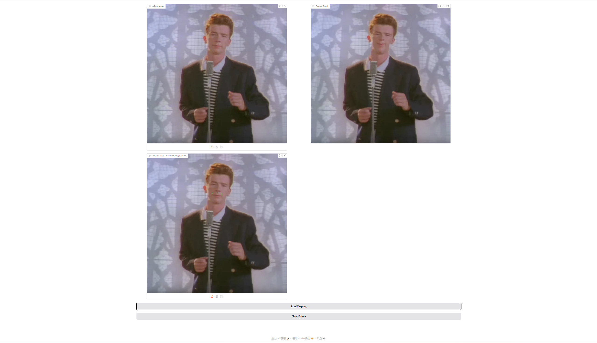
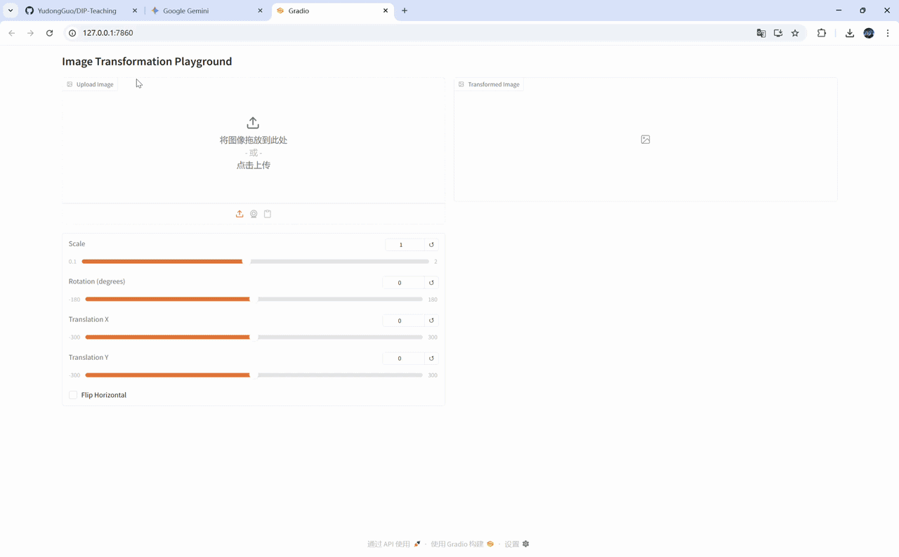

# Implementation of Image Geometric Transformation

This repository contains my implementation of Assignment 01 for Digital Image Processing (DIP).



## Requirements

Install dependencies with:

```bash
python -m pip install -r requirements.txt
```

## Running

Run basic global transformation (scale / rotation / translation / flip):

```bash
python run_global_transform.py
```

Run point-guided image deformation:

```bash
python run_point_transform.py
```

## Results

### Basic Transformation



### Point Guided Deformation


## Acknowledgement

Thanks for the algorithm inspiration from:
[Image Deformation Using Moving Least Squares](https://people.engr.tamu.edu/schaefer/research/mls.pdf).
