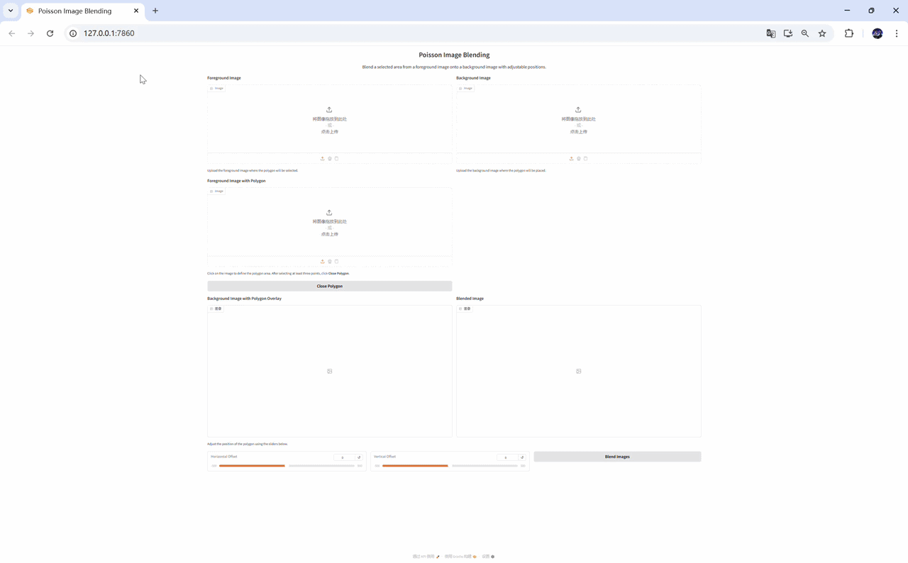
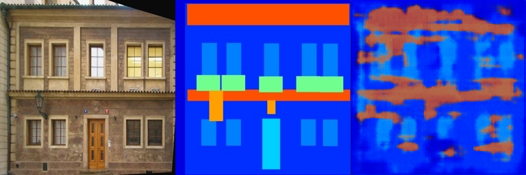
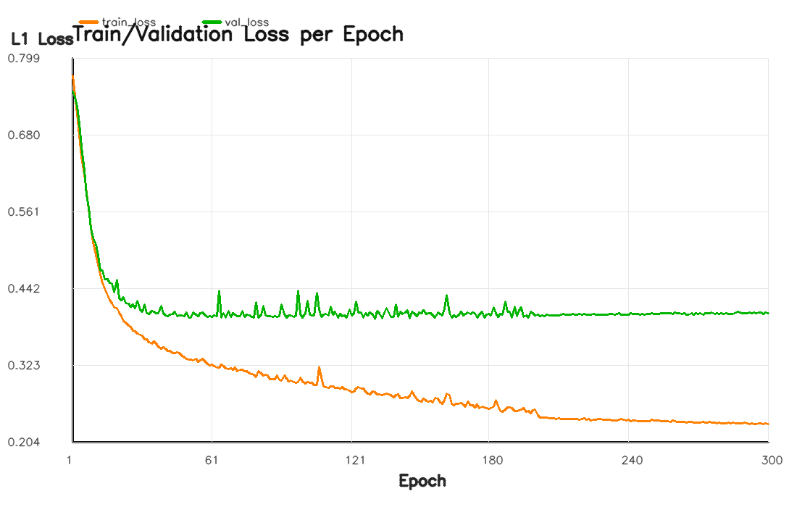
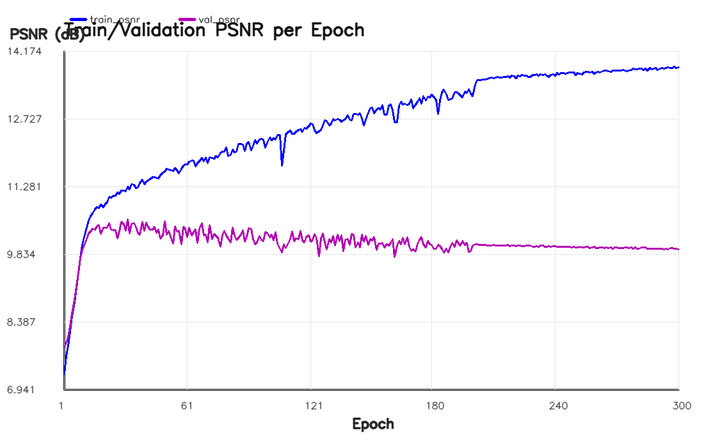
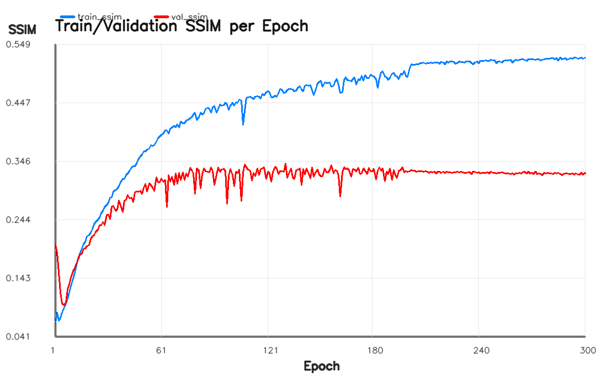

# Implementation of Image Geometric Transformation

This repository contains my implementation of Assignment 02 for DIP with PyTorch, including Poisson image blending and a Pix2Pix-style FCN training pipeline.


## Requirements

Install dependencies with:

```bash
python -m pip install -r requirements.txt
```

## Running

Run Poisson image blending interface:

```bash
python run_blending_gradio.py
```

Run Pix2Pix training:

```bash
cd Pix2Pix
python train.py
```

Pix2Pix training outputs will be saved automatically to:

- `Pix2Pix/train_results/epoch_xxx/result_*.png` (train visualization)
- `Pix2Pix/val_results/epoch_xxx/result_*.png` (validation visualization)
- `Pix2Pix/checkpoints/pix2pix_model_epoch_xxx.pth` (model checkpoints)

## Results

### Poisson Image Blending (`run_blending_gradio.py`)



### Pix2Pix Training Result (`Pix2Pix/train.py`)

Final validation visualization (epoch 295):



### Training Curves

#### Train vs Validation L1 Loss



#### Train vs Validation PSNR



#### Train vs Validation SSIM



### Curve Analysis

From `Pix2Pix/metrics/training_history.csv`:

1. **Best validation L1 loss** appears at **epoch 131**: `val_loss = 0.3946`, while epoch 300 is `0.4031`.
2. **Best validation SSIM** also appears at **epoch 131**: `val_ssim = 0.3409`, and drops to `0.3254` at epoch 300.
3. **Best validation PSNR** appears earlier at **epoch 32**: `val_psnr = 10.5775`, and declines to `9.9405` at epoch 300.
4. `train_loss` continues decreasing (`0.7724 -> 0.2311`), but validation metrics plateau or degrade later, indicating **mild overfitting** in late training.
