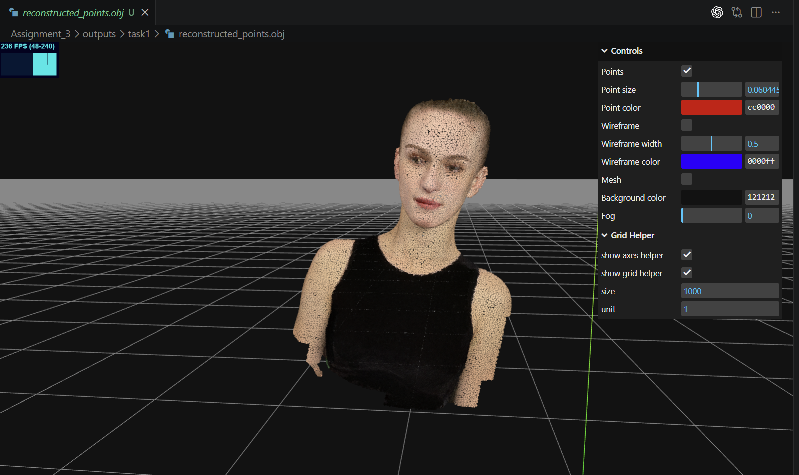
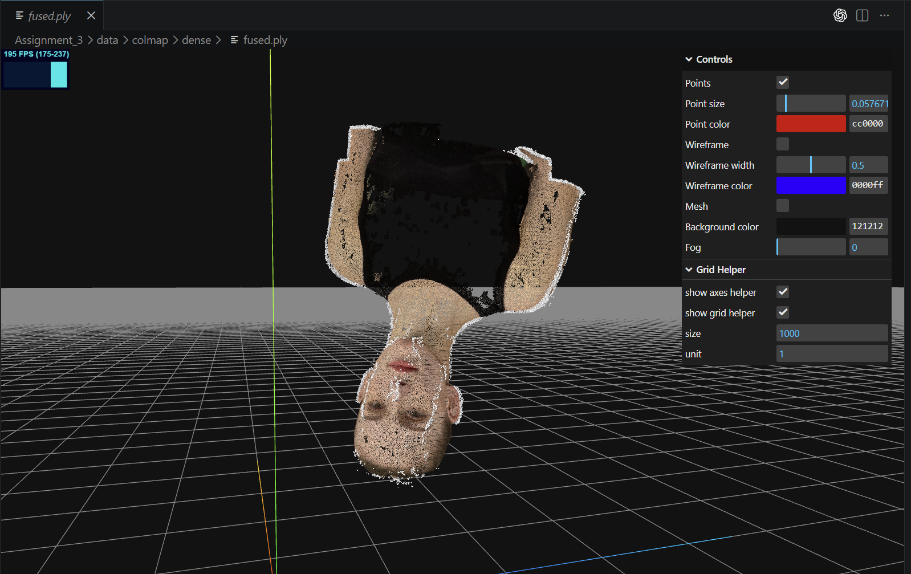

# Implementation of Bundle Adjustment and COLMAP Reconstruction

This repository contains my implementation of Assignment 03 for DIP, including:

- `Task 1`: Bundle Adjustment from scratch with PyTorch
- `Task 2`: Multi-view 3D reconstruction with COLMAP


## Requirements

Install the Python dependencies needed for `Task 1`:

```bash
pip install torch numpy
```

For `Task 2`, install `COLMAP`.

- Linux: install from the official package or `conda-forge`
- Windows: use the official release package from COLMAP
- If you use an RTX 50-series / Blackwell GPU on Windows, `COLMAP 4.0.3+` is recommended


## Running

Run `Task 1`:

```bash
python bundle_adjustment.py --num-steps 300
```

Run `Task 2` on Windows:

```bash
run_colmap.bat
```

Run `Task 2` on Linux:

```bash
bash run_colmap.sh
```

Main output files:

- `Task 1`: `outputs/task1/reconstructed_points.obj`
- `Task 1`: `outputs/task1/bundle_adjustment_result.npz`
- `Task 2`: `data/colmap/dense/fused.ply`


## Results

### Task 1: Bundle Adjustment with PyTorch

The bundle adjustment pipeline jointly optimizes:

- a shared focal length
- camera extrinsics for all 50 views
- 3D coordinates for all 20000 points

Final reconstruction preview:



From `outputs/task1/summary.json`:

- `num_views = 50`
- `num_points = 20000`
- `num_steps = 300`
- `focal_length = 972.35 px`
- `final_reprojection_loss = 9.0225`
- `final_pixel_rmse = 18.34 px`

#### Result Analysis

The reconstructed point cloud recovers the global human shape well, especially the head, neck, shoulders, and upper torso. Color information is preserved by exporting the optimized 3D points together with `points3d_colors.npy`, so the final OBJ can be viewed directly as a colored point cloud. The reprojection error decreases significantly during optimization, which indicates that the initialized cameras and 3D points are successfully refined by the bundle adjustment process.


### Task 2: 3D Reconstruction with COLMAP

The COLMAP pipeline includes:

1. feature extraction
2. exhaustive matching
3. sparse reconstruction / mapper
4. image undistortion
5. patch-match stereo
6. stereo fusion

Dense reconstruction preview:



#### Result Analysis

COLMAP reconstructs the full bust geometry from the 50 rendered input views and produces a dense fused point cloud in `fused.ply`. Compared with the PyTorch bundle adjustment result, the COLMAP output is denser and more surface-oriented, while also containing some additional noise around boundaries such as the shoulders and silhouette. The overall orientation of the model in the viewer may differ from Task 1 because COLMAP uses its own world coordinate convention, which does not affect the reconstruction quality itself.
