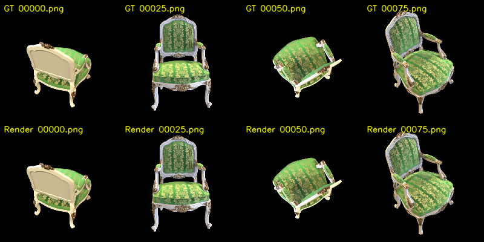
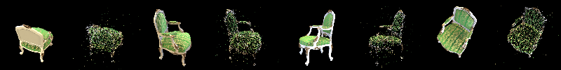
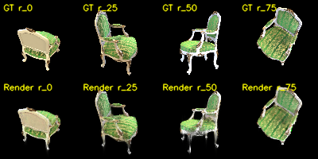
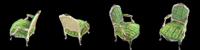

# Assignment 4：简化版 3D Gaussian Splatting

本项目实现了一条完整的三维重建与新视角渲染流程：首先使用 COLMAP 从多视角图像中恢复相机参数和稀疏点云，然后在纯 PyTorch 中将稀疏点参数化为三维高斯并完成可微投影与体渲染，最后与官方 3D Gaussian Splatting 实现进行定量和定性对比。

实验场景为 `chair`，共包含 100 张分辨率为 $800\times800$ 的多视角图像。



## 环境配置

本次实验的主要软硬件环境如下：

| 项目 | 配置 |
|---|---|
| 操作系统 | Windows |
| GPU | NVIDIA GeForce RTX 5070 Ti Laptop GPU，12227 MiB |
| Python | 3.10.20 |
| PyTorch | 2.7.1+cu128 |
| CUDA | 12.8 |
| 数据集 | Chair，100 张 $800\times800$ 图像 |

实验依赖包括 PyTorch、PyTorch3D、OpenCV、COLMAP，以及官方 3DGS 所需的 CUDA rasterizer。进入对应环境后即可运行下述命令。

## 运行方法

### COLMAP 稀疏重建与重投影

```bash
python mvs_with_colmap.py --data_dir data/chair
python debug_mvs_by_projecting_pts.py --data_dir data/chair
```

### 训练简化版 3DGS

```bash
python train.py \
    --colmap_dir data/chair \
    --checkpoint_dir data/chair/checkpoints \
    --num_epochs 200
```

从保存的 checkpoint 渲染环绕视频：

```bash
python render_3dgs_mv.py \
    --colmap_dir data/chair \
    --checkpoint data/chair/checkpoints/checkpoint_000180.pt \
    --output render_mv.mp4 \
    --num_frames 240 --fps 30
```

### 训练官方 3DGS

在 `gaussian-splatting` 目录下运行：

```bash
python train.py \
    -s ../data/chair \
    -m ../data/chair/official_3dgs_output \
    --iterations 30000

python render.py -m ../data/chair/official_3dgs_output
```

## Task 1：使用 COLMAP 完成 Structure from Motion

### 方法

COLMAP 首先提取每张图像的局部特征并进行跨视角匹配，再通过增量式 SfM 联合估计相机内参、相机外参和三维特征点。得到的相机采用 `PINHOLE` 模型，其内参为

$$
K =
\begin{bmatrix}
1110.322 & 0 & 400 \\
0 & 1110.499 & 400 \\
0 & 0 & 1
\end{bmatrix}.
$$

为了验证恢复出的相机位姿，将稀疏三维点通过

$$
\mathbf{x}\sim K(R\mathbf{X}+\mathbf{t})
$$

重新投影到对应图像平面，并检查投影点与物体轮廓、纹理位置是否对齐。

### 结果

| 指标 | 结果 |
|---|---:|
| 输入图像数 | 100 |
| 成功注册图像数 | 100 |
| 注册率 | 100% |
| 稀疏三维点数 | 13,610 |
| 平均重投影误差 | 0.4525 px |
| 重投影误差中位数 | 0.2605 px |

下图展示了四个视角的原图与稀疏点重投影结果。相邻图像分别为原图和对应的重投影点云。



### 分析

COLMAP 成功注册了全部视角，且平均重投影误差低于 0.5 像素，说明恢复出的内外参具有较高的几何一致性。从可视化结果也能看到，投影点整体落在椅子的表面和轮廓附近，椅背、坐垫与扶手等主要结构均能正确对齐。

另一方面，点云在纯色区域、遮挡边界和高光区域明显更稀疏。这是因为这些位置缺少稳定的局部纹理，难以形成可靠的特征匹配。因此，SfM 点云适合作为高斯中心的几何初始化，但不能直接作为稠密渲染结果。

## Task 2：简化版 3D Gaussian Splatting

### 3D 高斯参数化

每个 COLMAP 三维点被扩展为一个可优化的三维高斯，其参数包括位置、颜色、不透明度、三个方向的缩放以及单位四元数旋转。缩放参数使用对数空间表示，颜色和不透明度使用 logit 空间表示，以便在无约束参数上进行优化。

四元数首先被归一化并转换为旋转矩阵 $R$，缩放向量构成对角矩阵 $S$。实现中先计算 $M=RS$，再构造半正定协方差矩阵：

$$
\Sigma = MM^T = RSS^TR^T.
$$

对应实现在 [`gaussian_model.py`](gaussian_model.py) 中。

### 从 3D 高斯投影到 2D 高斯

三维中心首先通过外参变换到相机坐标系：

$$
\begin{bmatrix}X_c&Y_c&Z_c\end{bmatrix}^T
=R\boldsymbol{\mu}+\mathbf{t}.
$$

其像素坐标为

$$
\boldsymbol{\mu}'=
\begin{bmatrix}
f_xX_c/Z_c+c_x\\
f_yY_c/Z_c+c_y
\end{bmatrix}.
$$

透视投影在当前高斯中心处的雅可比矩阵为

$$
J=
\begin{bmatrix}
f_x/Z_c & 0 & -f_xX_c/Z_c^2\\
0 & f_y/Z_c & -f_yY_c/Z_c^2
\end{bmatrix}.
$$

先通过 $R\Sigma R^T$ 将协方差变换到相机空间，再计算二维协方差：

$$
\Sigma'=J(R\Sigma R^T)J^T.
$$

### 2D Gaussian 与 α-blending

对于像素 $\mathbf{x}$，二维高斯密度为

$$
f_i(\mathbf{x})=
\frac{1}{2\pi\sqrt{|\Sigma'_i|}}
\exp\left[-\frac{1}{2}
(\mathbf{x}-\boldsymbol{\mu}'_i)^T
{\Sigma'_i}^{-1}
(\mathbf{x}-\boldsymbol{\mu}'_i)\right].
$$

实现时在协方差对角线上加入 $10^{-4}$，避免求逆和行列式计算出现数值不稳定。所有高斯按照深度由近到远排序，并通过前向 α 合成得到最终颜色：

$$
\alpha_i=o_i f_i(\mathbf{x}),\qquad
T_i=\prod_{j<i}(1-\alpha_j),\qquad
C(\mathbf{x})=\sum_i T_i\alpha_i\mathbf{c}_i.
$$

投影、Gaussian 计算和 α-blending 均实现在 [`gaussian_renderer.py`](gaussian_renderer.py) 中，并保持了完整的 PyTorch 自动微分计算图。

### 训练设置

| 项目 | 设置 |
|---|---:|
| 训练视角 | 100 |
| 训练分辨率 | $100\times100$（原图下采样 8 倍） |
| 配置 epoch 数 | 200 |
| 每个 epoch 的更新次数 | 100 |
| Batch size | 1 |
| 损失函数 | RGB L1 loss |
| 初始高斯数 | 13,610 |
| Adaptive densification | 未使用 |
| 评测 checkpoint | epoch 180 |

训练循环的 epoch 编号从 0 开始，且每 20 个 epoch 保存一次，因此 200 个 epoch 训练中最后一个自动保存的文件为 `checkpoint_000180.pt`。

### 渲染结果

下图上行为四个训练视角的 GT，下行为简化版 3DGS 的渲染结果。



使用圆形相机轨迹得到的四个新视角如下。完整结果见 [`render_mv.mp4`](render_mv.mp4)。



在 100 个训练视角上评测 epoch 180 checkpoint，结果如下：

| 指标 | 结果 |
|---|---:|
| Mean L1 | 0.02194 |
| PSNR | 22.263 dB |
| SSIM | 0.9117 |
| 模型文件大小 | 2.19 MiB |

### 结果分析

简化版实现能够恢复椅子的整体形状，椅背、扶手、坐垫和四条椅腿在不同视角下均保持了基本一致的三维结构，说明相机投影、协方差传播、深度排序和 α-blending 的实现是有效的。

主要误差表现为轮廓模糊、局部浮点和细节缺失，尤其是在椅腿、雕花和遮挡边缘附近更明显。原因包括：

- 高斯数量始终固定为 13,610，无法在高频纹理和细小结构处自适应增加表示能力；
- 颜色仅使用每个高斯一个 RGB 向量，没有球谐函数，无法表达随观察方向变化的高光；
- 纯 PyTorch 实现对所有高斯和所有像素构造稠密中间张量，没有 tile culling，限制了可用分辨率；
- 训练只使用 L1 损失，没有额外的 SSIM 项或几何正则化；
- COLMAP 初始化点在弱纹理区域本身较稀疏，固定高斯集合难以补齐这些空洞。

## Task 3：与官方 3DGS 实现对比

### 官方实现结果

官方实现使用相同的 `chair` 图像和 COLMAP 初始化，训练 30,000 iterations。训练结束后，高斯数量由 13,610 自适应增长到 2,135,694。

下图上行为 GT，下行为官方实现的渲染结果。二者在轮廓、雕花纹理和高光处都非常接近。


官方实现未启用 `--eval`，因此这里与简化版一致，报告的是 100 个训练视角上的重建指标，而不是独立测试集上的新视角泛化指标。

| 评测分辨率 | PSNR | SSIM |
|---|---:|---:|
| 官方原始 $800\times800$ | 41.338 dB | 0.9966 |
| 官方下采样至 $100\times100$ | 45.260 dB | 0.9993 |

### 定量对比

为使质量指标可比，将官方输出额外下采样到简化版的 $100\times100$ 分辨率。渲染速度测试只统计 GPU 前向渲染核心，不包含模型加载、指标计算和 PNG 写盘；峰值显存为 `torch.cuda.max_memory_allocated()` 记录的渲染阶段峰值。

| 项目 | 简化版 PyTorch | 官方 3DGS |
|---|---:|---:|
| 训练/评测分辨率 | $100\times100$ | $800\times800$ |
| 最终高斯数 | 13,610 | 2,135,694 |
| $100\times100$ PSNR | 22.263 dB | 45.260 dB |
| $100\times100$ SSIM | 0.9117 | 0.9993 |
| 100 视角核心渲染耗时 | 40.93 s | 1.965 s |
| 核心渲染速度 | 2.44 FPS | 50.90 FPS |
| 渲染峰值显存 | 3853 MiB | 2423 MiB |
| 模型文件大小 | 2.19 MiB | 505.12 MiB |

简化版在 epoch 180 checkpoint 上额外进行了 1 次预热和 5 次前向/反向训练更新，平均每步为 1.387 s，即约 0.72 iteration/s，训练峰值显存为 8989.6 MiB，最终200个 epoch 总体训练时间约要7.6小时。官方训练完整训练约为 36 分 50 秒，对应约 13.6 iteration/s。

值得注意的是，官方模型在高斯数量约为简化版 157 倍、输出分辨率边长为 8 倍的情况下，核心渲染速度仍约为简化版的 20.8 倍，且渲染峰值显存更低。这说明性能差距主要来自 rasterizer 的实现方式，而不是模型规模。

### 差异来源分析

1. **Adaptive densification 与 pruning。** 官方实现根据位置梯度复制或分裂高斯，并删除贡献过低或尺度异常的高斯，使模型容量集中在轮廓、纹理和几何细节处。简化版始终使用初始稀疏点，表达能力受到明显限制。

2. **球谐颜色表示。** 官方实现使用最高三阶球谐系数描述视角相关颜色，能够拟合高光和方向相关外观；简化版只优化固定 RGB。

3. **Tile-based rasterization。** 官方 CUDA rasterizer 先确定高斯覆盖的 tile，只对局部相关的高斯进行排序和合成。简化版显式构造形状接近 $N\times H\times W$ 的 Gaussian 和 alpha 张量，计算量及显存随高斯数和像素数直接增长。

4. **可见性裁剪和提前终止。** 官方实现只处理视锥内、屏幕覆盖有效的高斯，并可在透射率接近零时停止合成；简化版仅使用深度范围 mask，仍会为无效或远离屏幕的高斯计算完整像素网格。

5. **优化目标与训练策略。** 官方实现联合使用 L1 与 DSSIM，并采用分参数学习率、opacity reset 和逐步提高球谐阶数等策略；简化版使用单一 L1 监督，优化策略较为基础。

6. **模型容量与文件大小。** 官方方法通过更多高斯和球谐系数换取了显著更高的重建质量，因此最终 PLY 达到 505.12 MiB；简化版 checkpoint 仅为 2.19 MiB，但渲染质量明显较低。

## 总结

本实验完成了从 COLMAP 相机恢复、三维高斯初始化、透视投影、二维协方差传播到前向 α 合成的完整可微 3DGS pipeline。简化版成功恢复了场景的整体三维结构，并在训练视角上达到 22.263 dB PSNR 和 0.9117 SSIM。与官方实现的对比表明，adaptive densification、球谐外观建模以及 tile-based CUDA rasterizer 是官方 3DGS 同时获得高质量、高速度和较低渲染显存占用的关键。

本报告的质量指标来自训练视角，尚不能等价于新视角泛化能力。后续可启用固定 train/test split，并在相同输出分辨率、相同测试视角和统一计时范围下进行更严格的比较。

## 致谢

- [3D Gaussian Splatting for Real-Time Radiance Field Rendering](https://repo-sam.inria.fr/fungraph/3d-gaussian-splatting/)
- [Official 3D Gaussian Splatting Implementation](https://github.com/graphdeco-inria/gaussian-splatting)
- [COLMAP](https://colmap.github.io/)
